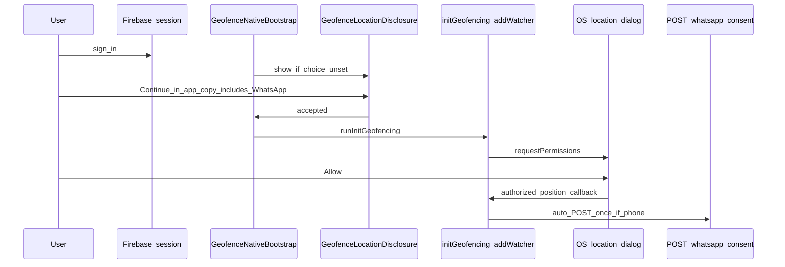

# Klaviyo WhatsApp marketing opt-in (with geofence flow)

## Implementation order

1. **Klaviyo API research** — Lock WhatsApp marketing consent payload for `KLAVIYO_API_REVISION`.
2. **Backend route + service** — `POST` (e.g. `/marketing/whatsapp-consent`) + OpenAPI export.
3. **Codegen** — `npm run gen:api` in `frontend/`.
4. **Auth gate (Option B)** — Geofence bootstrap **inside** `AuthProvider` (`MyApp` cannot use `useAuth()`).
5. **OS location → WhatsApp** — Wire automatic subscribe in [`geofenceManager.ts`](f:/madmonkey2/MM_V3/frontend/services/geofencing/geofenceManager.ts) (or a tiny helper imported only there) when **OS** permission is effectively granted and location updates succeed; **dedupe** so Klaviyo is not hit on every GPS tick.
6. **Disclosure copy** — Update [`GeofenceLocationDisclosure.tsx`](f:/madmonkey2/MM_V3/frontend/components/molecules/GeofenceLocationDisclosure.tsx) so bundled consent is clear (legal/marketing approval).
7. **Docs** — Describe the flow and compliance note.

## Product rule (locked)

- **Option B:** No geofence pipeline for **logged-out** users (native + signed-in + rehydrated before disclosure/init).
- **WhatsApp:** When the user **allows OS location permission** for the geofence watcher (system dialog outcome → first authorized location path in the plugin), **automatically** call the backend to **subscribe** the user to **WhatsApp marketing** in Klaviyo. **No separate checkbox.**
- If the user **denies** OS location, **do not** call the subscribe endpoint.
- If **`customer.phone`** is missing, backend returns **400** or no-op per product choice; client should still avoid spamming (log once).

## Compliance note (mandatory review)

Bundling **WhatsApp marketing** with **system location “Allow”** must be reflected in **in-app disclosure** and may still need review against **Meta / regional** marketing consent rules. The plan assumes **legal approves** the combined copy on [`GeofenceLocationDisclosure`](f:/madmonkey2/MM_V3/frontend/components/molecules/GeofenceLocationDisclosure.tsx) and any App Store / Play Data Safety disclosures.

## Technical trigger (client)

- **Where:** [`geofenceManager.ts`](f:/madmonkey2/MM_V3/frontend/services/geofencing/geofenceManager.ts) — inside the `addWatcher` callback path where the app receives a **valid position** (or explicit transition from `NOT_AUTHORIZED` / no permission to authorized), **after** `initGeofencing` has started the watcher.
- **Guards:** Native platform; user **signed in** (Firebase `currentUser` or equivalent passed/checked from bootstrap—avoid circular imports); **`customer.phone`** present if you can read it from context/store or a lightweight fetch; **once per user/device** via e.g. `localStorage` key `mm_klaviyo_whatsapp_auto_subscribe_done_v1` or server idempotency.
- **Non-blocking:** Klaviyo failures must **not** stop the watcher or geofence logic.

## Backend

1. **`POST /marketing/whatsapp-consent`** (example path): `firebaseAuth`, Zod body `{ consented: true, source: "os_location_granted" }` (or minimal shape), resolve **customer**, **require** normalized **phone**, call **`KlaviyoProfilesClient`**.
2. Reuse Klaviyo env vars as in [`KlaviyoEventsClient`](f:/madmonkey2/MM_V3/backend/src/services/KlaviyoEventsClient.ts).
3. OpenAPI + **`npm run gen:api`**; do not hand-edit generated output.

## `GeofenceSyncOnAuth`

Re-evaluate after Option B + OS-triggered subscribe; may still help **empty geofence snapshot** refresh on login, or be narrowed/removed if redundant.

## Logout

Disclosure storage across logout remains a **product** decision (see previous plan version).

## Flow diagram

## Preconditions (outside code)

- Klaviyo **WhatsApp** + **Meta WhatsApp Business**; approved **marketing** templates.

## Testing

- Logged out: no geofence init from this flow.
- Logged in, disclosure Continue, **OS Allow:** one subscribe call (verify dedupe); Klaviyo profile updated when phone exists.
- **OS Deny:** no subscribe call.
- **No phone on profile:** no successful subscribe; watcher may still run per current geofence rules.
- **Klaviyo error:** geofencing continues.

## Rejected

- **Separate WhatsApp checkbox** (superseded by product: auto on OS Allow).
- **Option A** logged-out geofence (no use case).
