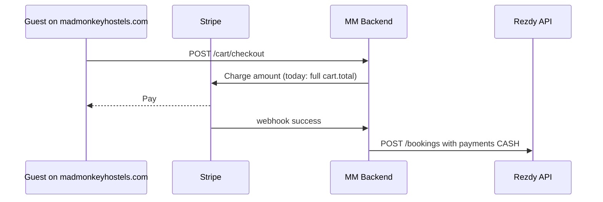
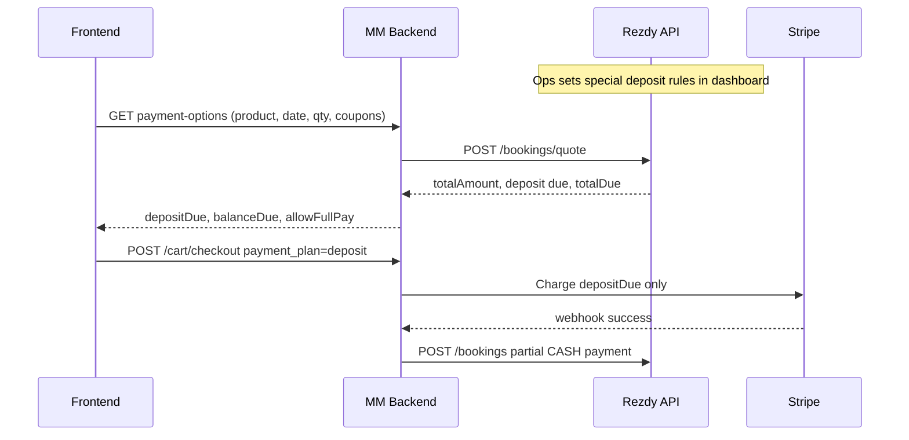
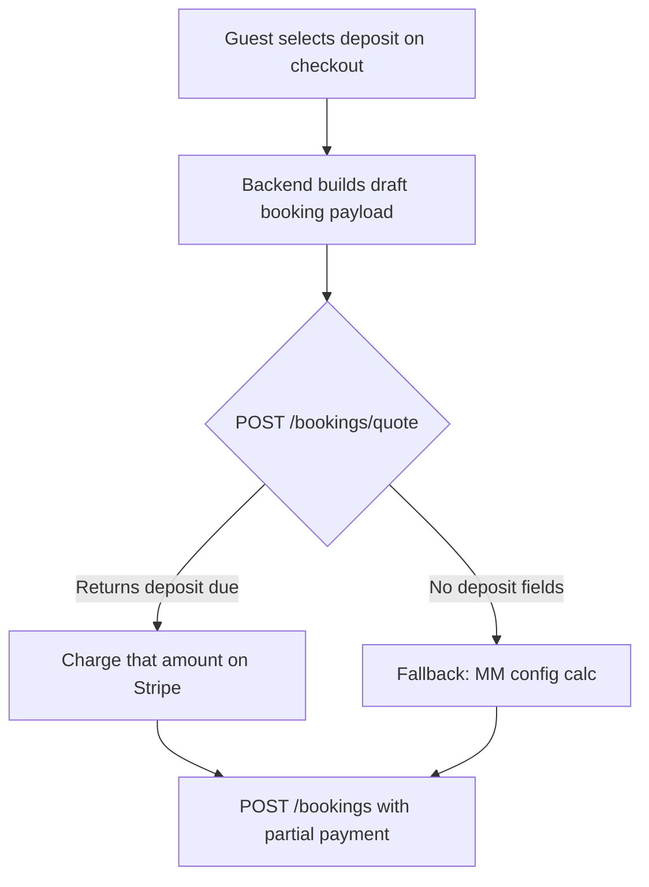

# Tour $100 Deposit via Rezdy (updated)

## Is Rezdy "Use special deposit rules" useful?

**Short answer: Yes for operations — No as a substitute for website/API work.**

Rezdy's product-level **Use special deposit rules** (Inventory → Products) lets you define per-product deposit policies: fixed amount (e.g. $100), percentage, and optionally **allow full payment** so guests can choose deposit vs pay-in-full on **Rezdy's native booking widget**.

### What it helps with (enable it)

- **Front office / property staff**: Orders in Rezdy show `totalPaid`, `totalDue`, and unpaid balance — staff collect balance in Rezdy as you described ([How To Charge a Credit Card](https://support.rezdy.com/hc/en-us/articles/19867756756636-How-To-Charge-a-Credit-Card)).
- **Automated balance reminders**: Rezdy can send [Automated Payment Requests](https://support.rezdy.com/hc/en-us/articles/19867864865948-How-To-Set-Up-Automated-Payment-Requests) for remaining balance (optional; balance may still be collected on arrival).
- **Business rule documentation**: Ops sees the $100 deposit policy on the product in Rezdy admin, aligned with what guests see on the website.

### What it does NOT do for MM V3

Mad Monkey checkout **does not use Rezdy's online payment UI**. Today the flow is:



Rezdy dashboard deposit rules **do not automatically**:

- Change what Stripe charges on [`madmonkeyhostels.com/booking`](https://madmonkeyhostels.com/booking?type=tours)
- Drive the deposit/full-pay UI in [`BookingToursPriceDetail.tsx`](frontend/components/molecules/BookingToursPriceDetail.tsx)
- Set the payment amount when [`RezdyBookingService.createBooking`](backend/src/services/RezdyBookingService.ts) runs

The [Rezdy Supplier API](https://developers.rezdy.com/rezdyapi/index-supplier.html) expects **you to record the external payment** in `payments[]`. Rezdy then computes `totalPaid` / `totalDue` on the booking response — partial payment is supported at the API level, but MM must send the correct amount.

Deposit rule fields are **not exposed** in MM's current [`RezdyProduct`](backend/src/utils/Rezdy.ts) type or product fetch path, so the website cannot read "$100 deposit enabled" from Rezdy today without extra API investigation.

### Recommendation

| Layer               | Action                                                                                                                                                          |
| ------------------- | --------------------------------------------------------------------------------------------------------------------------------------------------------------- |
| **Rezdy dashboard** | Enable special deposit rules on eligible tour products: fixed **$100 per order**, enable **allow full payment** if guests should choose. Mirror policy for ops. |
| **MM V3 backend**   | Required: charge deposit via Stripe, create Rezdy booking with full line prices + partial `payments` line.                                                      |
| **MM V3 frontend**  | Required: deposit vs full-pay selector + price breakdown on checkout.                                                                                           |

Do **not** rely on Rezdy deposit rules alone — without MM changes, guests would still be charged **full `cart.total`** via [`resolvePricingFromCart`](backend/src/services/CheckoutService.ts) and Rezdy would receive a **full** CASH payment.

---

## Will enabling Rezdy "Use special deposit rules" auto-sync to the frontend?

**No — not with the codebase as it exists today, and not by only toggling Rezdy.**

| Expectation                                                            | Reality today                                                                 |
| ---------------------------------------------------------------------- | ----------------------------------------------------------------------------- |
| Turn on special deposit rules in Rezdy → frontend shows deposit option | **Does not happen** — no code reads Rezdy deposit config                      |
| Change $100 → $150 in Rezdy → website updates automatically            | **Does not happen** — frontend uses cart totals + full Stripe charge          |
| Deposit rules stay aligned with Rezdy ops dashboard                    | **Only after we build sync** — Rezdy dashboard still worth enabling for staff |

**Deposit ≠ coupon/discount.** Rezdy deposit rules control **how much is paid now vs on arrival**. Tour coupons (`ManualCouponInput`) are a separate flow and would still apply to the **full tour total**; balance due = discounted total − deposit paid.

### What would be required for "change Rezdy → frontend reflects it"

1. **Backend endpoint** (e.g. `GET /tours/{productCode}/payment-options` or include in cart checkout preview) that calls Rezdy with the draft booking (product, date, quantity).
2. **Prefer `POST /bookings/quote`** — may apply Rezdy business rules including deposit ( **unverified spike required** ).
3. **Frontend** reads that response to show deposit amount, balance due, and whether full-pay is allowed — not hardcoded $100.
4. **Checkout** charges whatever the backend resolved from Rezdy (or fallback config), not `cart.total`.

Note: MM's [`RezdyBookingQuoteResponse`](backend/src/utils/Rezdy.ts) type only documents `totalAmount`, `currency`, `items` — not `totalDue` or deposit fields. The live API response may include more; the spike must capture the full JSON.

**Until that backend is built, Rezdy dashboard changes will not appear on madmonkeyhostels.com.**

---

## Agreed approach: backend + frontend (Rezdy as source of truth)

Backend updates are **in scope** and are the bridge between Rezdy settings and the website.



**When ops changes deposit in Rezdy** → next checkout quote returns new amounts → frontend shows updated deposit **without a deploy** (if quote spike succeeds).

### Backend deliverables

| Piece                           | File / area                                 | Purpose                                                                                          |
| ------------------------------- | ------------------------------------------- | ------------------------------------------------------------------------------------------------ |
| Quote spike script or test      | `backend/` one-off                          | Validate Rezdy quote JSON with deposit rules on                                                  |
| `RezdyTourPaymentService` (new) | `backend/src/services/`                     | Build draft booking from cart; call `quoteBooking()`; parse deposit due                          |
| Payment options route           | `backend/src/routes/cart.ts` or tours route | `GET /cart/payment-options` or include in cart GET — expose quote to frontend                    |
| OpenAPI schema                  | `backend/src/openapi/`                      | Typed response: `depositDue`, `balanceDue`, `totalAmount`, `allowFullPay`, `depositEnabled`      |
| Checkout changes                | `cart.ts`, `CheckoutService.ts`             | Re-quote at checkout; charge `depositDue` when `payment_plan=deposit`; never trust client amount |
| Rezdy booking                   | `RezdyBookingService.ts`                    | Partial `payments[]`; full item prices; metadata `payment_plan=deposit`                          |
| Quote types                     | `backend/src/utils/Rezdy.ts`                | Extend `RezdyBookingQuoteResponse` from spike (likely `totalDue`, not just `totalAmount`)        |

**Security:** Frontend sends `payment_plan` only. Backend **re-computes** deposit amount from Rezdy quote at checkout — do not accept `deposit_amount_minor` from the client as authoritative.

### Frontend deliverables (thin — driven by backend)

- Fetch payment options when tour checkout loads or cart/date/qty changes
- Render deposit vs full-pay only if `depositEnabled && allowFullPay` (or deposit-only if not)
- Display `depositDue` / `balanceDue` from API — no hardcoded $100
- Pass `payment_plan: "full" | "deposit"` to checkout

### Fallback if quote spike fails

- Backend reads deposit rules from MM env/config per `product_code`
- Ops must update Rezdy **and** MM config when amounts change
- Same checkout + partial booking flow; only the **resolver** differs

---

## Can we follow Rezdy deposit settings from the API?

**Not directly from `GET /products` today.** The [Rezdy Supplier API](https://developers.rezdy.com/rezdyapi/index-supplier.html) product object does not document deposit-rule fields (`depositAmount`, per-person vs per-order, allow full pay, etc.). MM’s [`RezdyProduct`](backend/src/utils/Rezdy.ts) type has no deposit fields either.

**Possible workaround — `POST /bookings/quote` (needs a spike):**

MM already has an unused client method:

```237:242:f:/madmonkey2/MM_V3/backend/src/utils/Rezdy.ts
  /**
   * Quote a booking (calculate totals without creating)
   */
  public async quoteBooking(booking: RezdyBookingCreateRequest): Promise<RezdyBookingQuoteResponse> {
    return this.makeRequest('/bookings/quote', 'POST', booking);
  }
```

Rezdy docs say quote **validates business rules** and **populates all amounts/totals** before booking. In theory, if special deposit rules are enabled on the product, a quote for `{ productCode, date, quantities }` **without full payment** might return:

- `totalAmount` (full tour price)
- `totalDue` / implied deposit due now
- possibly `paymentOption`

**We have not verified this against your live Rezdy account** — this is the first implementation step.

### Recommended approach (phased)

| Phase                        | Source of truth                                                                 | Ops updates deposit in…                        |
| ---------------------------- | ------------------------------------------------------------------------------- | ---------------------------------------------- |
| **Phase 0 (spike)**          | Call `POST /bookings/quote` on `P0TJG8` after configuring special deposit rules | Rezdy only — test if quote returns deposit due |
| **Phase 1 (if quote works)** | Rezdy quote at checkout time                                                    | Rezdy product settings only                    |
| **Phase 1 (if quote fails)** | MM backend config mirroring Rezdy                                               | Rezdy + MM env/config (manual sync)            |



### Per-person vs per-order (your screenshot)

Your screenshot shows **“Deposit (Fixed amount per person/quantity)”**:

| Rezdy setting               | 1 guest | 2 guests |
| --------------------------- | ------- | -------- |
| Fixed **per person** @ $100 | $100    | $200     |
| Fixed **per order** @ $100  | $100    | $100     |

If the business rule is “$100 to hold a booking regardless of party size”, use **per order**, not per person. If quote API works, Rezdy calculates this for you from the product rule — no duplicate logic in MM.

**“Allow customers to pay full amount”** (unchecked in your screenshot): deposit-only on Rezdy widget. For MM, we can still offer full-pay if product allows it — again, quote API or explicit config would drive that.

---

## Where do you update the deposit amount?

**Two separate places — they must stay in sync.**

### 1. Rezdy dashboard (ops / front office only)

**Yes — use "Use special deposit rules" here**, but only for Rezdy-side behavior:

1. Rezdy → **Inventory** → **Products** → open the tour (e.g. `P0TJG8`)
2. Enable **Use special deposit rules**
3. Set deposit type: **Fixed amount per order** (not percentage)
4. Enter the amount (e.g. **100**) and currency (**USD**)
5. Optionally enable **Allow full payment** so Rezdy’s own widget matches “deposit or pay in full”

Changing this updates:

- What Rezdy shows staff on orders (`totalDue`, payment expectations)
- Rezdy native booking widget (if anyone books through Rezdy directly)
- Automated payment request templates tied to that product

Changing this does **not** update what **madmonkeyhostels.com** charges via Stripe.

### 2. MM backend (what guests pay online — after implementation)

Once the payment-options + quote flow is built, **Rezdy dashboard is the source of truth**. Ops updates deposit in Rezdy only; backend re-quotes on each checkout.

Fallback (if quote spike fails): env/config in backend, manual sync with Rezdy.

---

## Target behavior

Guest on `/booking?type=tours` sees:

- Tour total (full price)
- Option: **Pay $100 deposit now** (balance due on arrival) or **Pay in full**
- Stripe charges selected amount only
- Rezdy order: `totalAmount` = full tour price, `totalPaid` = $100, `totalDue` = balance, status `CONFIRMED`
- Property front office collects balance in Rezdy dashboard

---

## Backend changes (detailed)

### 0. Quote spike (blocker)

Call `POST /bookings/quote` for `P0TJG8` with special deposit rules enabled. Document response fields. Decide primary vs fallback path.

### 1. Payment options API (new)

Example response shape (OpenAPI):

```ts
{
  depositEnabled: boolean;
  allowFullPay: boolean;
  totalAmount: number;
  depositDue: number; // charge now if payment_plan=deposit
  balanceDue: number; // pay on arrival
  currency: string;
}
```

Implementation: new service calls `RezdyAPI.quoteBooking()` with cart item (productCode, startTimeLocal, quantities). Parse quote response per spike findings.

Expose via route tied to cart session (e.g. when cart has rezdy item) so frontend gets options on `/booking?type=tours`.

### 2. Checkout API — payment plan + server-side amount

Extend [`checkoutSchema`](backend/src/routes/cart.ts):

```ts
payment_plan: z.enum(["full", "deposit"]).optional().default("full");
// Do NOT accept client deposit_amount_minor as authoritative
```

In rezdy branch (~line 1689):

- Re-run quote (or reuse cached quote with short TTL)
- `payment_plan === "deposit"` → `amountMinor = toMinor(depositDue)`
- `payment_plan === "full"` → `amountMinor = toMinor(totalAmount)` (after coupons)
- Validate deposit < total; Stripe minimum
- Stripe metadata: `payment_plan`, `full_amount_minor`, `deposit_amount_minor`, `balance_due_minor`

[`CheckoutService.processCheckout`](backend/src/services/CheckoutService.ts) already supports `opts.amountMinor` override.

Regenerate frontend client: `npm run gen:api`.

### 3. Rezdy booking — partial payment line

In [`RezdyBookingService.createBooking`](backend/src/services/RezdyBookingService.ts):

- Keep **full** `optionPrice` on booking items (Rezdy calculates total)
- Set `payments[].amount` = **actual Stripe capture** (from quote/depositDue), label `"Deposit via Stripe"`
- When deposit mode: skip discount subtraction on payment line; comment `"Balance due on arrival"`
- Existing `computePaymentMajor` uses received amount when it differs >1% from full price

### 4. Persist plan for confirmation

Store in `stripe_payment_intents.metadata` and `cart_payments.pricing_snapshot`:

- `payment_plan`, `amount_due_now`, `balance_due`

### 5. Notifications

Update [`OrderConfirmationData`](backend/src/services/RezdyBookingService.ts) n8n payload: show deposit paid + balance due when partial.

---

## Frontend changes

### 1. Fetch payment options from backend

On tour checkout load (and when date/guests/coupons change), call new payment-options endpoint. Store `depositDue`, `balanceDue`, `allowFullPay`, `depositEnabled`.

### 2. Payment selector — [`BookingToursPriceDetail.tsx`](frontend/components/molecules/BookingToursPriceDetail.tsx)

- Show deposit UI only when `depositEnabled`
- **Default UX:** two radios — **Pay deposit now** (`depositDue`) and **Pay in full** (`totalAmount`) when `allowFullPay` (expected on most tours)
- Deposit-only UI only when Rezdy has allow full pay off (exception)
- Labels use API amounts — e.g. `Pay $100 deposit` / `Balance $X due on arrival`
- Button: `CONFIRM & PAY {depositDue}` vs `CONFIRM & PAY {totalAmount}`

### 3. Checkout wiring — [`booking/index.tsx`](frontend/pages/booking/index.tsx)

- Pass `payment_plan: "full" | "deposit"` only (no client-side amount)
- GTM `begin_checkout` value = amount charged now from payment options

### 4. Thanks page — deposit confirmation (planned)

**Pages:** [`success.tsx`](frontend/pages/booking/success.tsx) only redirects → [`thanks.tsx`](frontend/pages/booking/thanks.tsx) is the confirmation UI.

**Today:** Thanks loads `GET /cart/{cartId}/confirmation` via [`fetchCartConfirmation`](frontend/services/v3-services/cartConfirmation.ts). [`BookingSuccessToursPriceDetail`](frontend/components/molecules/BookingSuccessToursPriceDetail.tsx) shows line items + **Total** (full tour price). Success copy: _“We’ve received your payment and your reservation is confirmed.”_ No deposit/balance breakdown.

**Planned — backend extends confirmation payload** (OpenAPI + `npm run gen:api`):

```ts
payment: {
  plan: "full" | "deposit";
  tourTotal: number; // full booking value
  paidToday: number; // Stripe capture
  balanceDue: number; // pay at property (0 if full pay)
  currency: string;
}
```

Source: `stripe_payment_intents.metadata` + `pricing_snapshot` (written at checkout); optionally cross-check Rezdy `totalDue` from booking if available.

**Planned — thanks UI (deposit path):**

```
Price Details
2 persons                              $500.00
[addons / coupons as today]

Tour total                             $500.00
Paid today                             $200.00
Balance due on arrival                 $300.00   ← highlighted info callout

[Optional info box]
Pay the remaining balance at the property front desk.
Your Rezdy booking reference: RSQxxxx
```

**Full pay path:** unchanged — single **Total** / amount paid; no balance line.

**Header copy (deposit):** e.g. _“Your booking is confirmed! A balance of $300 is due on arrival.”_ instead of generic full-payment only (keep full-pay wording for `payment.plan === "full"`).

**Email (n8n):** Same three numbers in order confirmation payload ([`OrderConfirmationData`](backend/src/services/RezdyBookingService.ts) todo).

**GTM purchase event:** `value` = `paidToday` (amount charged), optional `balance_due` param for analytics.

### 5. My Bookings tour detail — deposit breakdown (planned)

**Page:** [`/my-bookings/tours/[id]`](frontend/pages/my-bookings/[type]/[id].tsx) (e.g. `RNLWZYT` = Rezdy `orderNumber`).

**Today:** Loads `CustomerService.getCustomerBookingsTours({ id })` → Mongo `rezdy_bookings`. [`MyBookingSummaryTour`](frontend/components/molecules/MyBookingSummaryTour.tsx) shows guests + line items + **Total** only. It uses `bookingInfo.pricingDetails.amount_after` or `items[0].amount` — **not** `totalPaid` / `totalDue`.

**Good news:** The API response already includes Rezdy fields on the spread booking document ([`RezdyBookingItem`](frontend/types/rezdyBooking.ts): `totalAmount`, `totalPaid`, `totalDue`, `payments[]`). **No new backend route required** for v1 — wire existing fields in the frontend.

**Planned UI** (mirror thanks page when `totalDue > 0`):

```
Price Details
2 persons (Adult)                        $500.00
[addons]

Tour total                               $500.00
Paid                                     $200.00
Balance due on arrival                   $300.00

Pay the remaining balance at the property front desk.
```

**When `totalDue === 0`:** keep current single **Total** row (full pay or balance already collected).

**Data rules:**

| Field       | Source                                                              |
| ----------- | ------------------------------------------------------------------- |
| Tour total  | `totalAmount` (fallback: `bookingInfo.pricingDetails.amount_after`) |
| Paid        | `totalPaid`                                                         |
| Balance due | `totalDue`                                                          |

After staff records a balance payment in Rezdy, Mongo should reflect updated `totalPaid`/`totalDue` via existing Rezdy sync — my-bookings will show reduced balance on refresh (verify webhook/update path during implementation).

**Files to touch:**

- [`MyBookingSummaryTour.tsx`](frontend/components/molecules/MyBookingSummaryTour.tsx) — add optional `totalAmount`, `totalPaid`, `totalDue` props; conditional breakdown
- [`my-bookings/[type]/[id].tsx`](frontend/pages/my-bookings/[type]/[id].tsx) — pass Rezdy fields from `tourBookingDetails`

### 6. My Bookings list — balance badge (**out of scope**)

**Decision:** Do **not** show balance on list cards (`MyTourBooking`). Guests see paid/balance only on **tour detail** (§5) and **thanks/confirmation** (§4).

**Effect on gaps:** Removes only the need to verify list-card refresh when Rezdy balance is collected. Does **not** remove checkout, Rezdy payment math, confirmation API, email, or analytics gaps.

---

## Rezdy dashboard setup (confirmed baseline)

Product deposit config (ops source of truth for spike + alignment):

| Setting                            | Value                                | Notes                                                                                                                                                                                   |
| ---------------------------------- | ------------------------------------ | --------------------------------------------------------------------------------------------------------------------------------------------------------------------------------------- |
| Use special deposit rules          | On                                   | Required                                                                                                                                                                                |
| Deposit type                       | **Fixed amount per person/quantity** | $100 **per guest** — 2 guests = $200 deposit, 1 guest = $100                                                                                                                            |
| Deposit amount                     | **100**                              | Per person/quantity unit; confirm currency matches product (USD)                                                                                                                        |
| Allow customers to pay full amount | **On** (default policy)              | **Always on for MM tours** — deposit is optional; guest chooses **deposit (× guests)** or **pay in full**. Backend sets `allowFullPay: true` unless quote/Rezdy explicitly disables it. |
| Add minimum notice                 | **Off**                              | Deposit allowed even for last-minute bookings; enable later if ops wants close-in = full pay only                                                                                       |

Expected MM behaviour when quote spike succeeds:

- 1 guest → deposit due = **$100**, balance = tour total − $100
- 2 guests → deposit due = **$200**, balance = tour total − $200
- N guests → deposit due = **$100 × N** (Rezdy quote should calculate; spike test C validates)
- Checkout shows **Pay deposit** (amount scales with guests) and **Pay in full**
- Rezdy order after deposit: `totalPaid` = deposit charged, `totalDue` = remainder

**Ops note:** Changing to per order in Rezdy later would flatten deposit to $100 regardless of guests — quote-driven checkout should pick that up without a deploy.

Optional later: turn on **Add minimum notice** (e.g. 7 days) so bookings within that window require full payment — include in quote spike test D when enabled.

---

## Rezdy dashboard setup (parallel, no code)

For each eligible tour product (e.g. `P0TJG8`):

1. Product → enable **Use special deposit rules**
2. Rule: **Fixed amount per person/quantity**, **$100** (confirm currency = USD)
3. Enable **Allow full payment** (standard MM policy)
4. Optional: **Add minimum notice** if close-in bookings must pay in full

---

## Edge cases

| Case                          | Handling                                                                    |
| ----------------------------- | --------------------------------------------------------------------------- |
| Tour total ≤ deposit × guests | Hide deposit or force full pay (e.g. $80 tour, $100/person deposit)         |
| Non-USD cart                  | Convert deposit (100 × qty) to cart/destination currency for Stripe + Rezdy |
| Tour addons                   | Decide: deposit on tour only, addons charged upfront (recommended)          |
| Coupons                       | Apply to full total; balance = discounted total − deposit                   |
| Free tours                    | Existing `free_booking` path unchanged                                      |

---

## How to run the quote spike (manual test)

### Unblock checklist (do these in parallel)

| #   | Owner             | Action                                                                                                                            | Blocks if missing                             |
| --- | ----------------- | --------------------------------------------------------------------------------------------------------------------------------- | --------------------------------------------- |
| 1   | **Ops / product** | Rezdy → Inventory → product (e.g. `P0TJG8`) → **Use special deposit rules** ON, $100 per person, **Allow full payment** ON → Save | Quote won’t return deposit logic              |
| 2   | **Dev / infra**   | `REZDY_API_KEY` in `backend/.env.local` (use **staging/sandbox** key if you have one; avoid prod unless intentional)              | API calls fail immediately                    |
| 3   | **Dev**           | Pick a **real session** with availability (see step below)                                                                        | Quote returns no slot / error                 |
| 4   | **Dev**           | Run tests A–C (below), **save full JSON** for each                                                                                | Can’t choose Rezdy-driven vs config fallback  |
| 5   | **Team**          | Paste results into ticket/plan; decide pass/fail                                                                                  | Implementation stays blocked on amount source |

**Time:** ~30–60 min once #1 and #2 are done.

### Step 3 — find a valid `startTimeLocal`

Option A — Rezdy dashboard: product → availability calendar → copy date/time.

Option B — API (with key):

```bash
curl -s "https://api.rezdy.com/v1/availability?apiKey=YOUR_KEY&productCode=P0TJG8&startTimeLocal=2026-07-13%2009:00:00&endTimeLocal=2026-07-20%2009:00:00"
```

Use a slot that returns seats &gt; 0. Format: `YYYY-MM-DD HH:mm:ss` (local, as Rezdy expects).

### Step 4 — run quote (pick one method)

**Option A — curl** (no repo setup):

```bash
curl -s -X POST "https://api.rezdy.com/v1/bookings/quote?apiKey=YOUR_KEY" \
  -H "Content-Type: application/json" \
  -d '{
    "customer": { "firstName": "Test", "lastName": "Spike", "email": "test@example.com" },
    "items": [{
      "productCode": "P0TJG8",
      "startTimeLocal": "2026-07-13 09:00:00",
      "quantities": [{ "optionLabel": "Adult", "value": 1 }]
    }]
  }'
```

Repeat with `"value": 2` for test C. For test B, add `"payments": [{ "type": "CASH", "amount": 100, "currency": "USD", "label": "Deposit test" }]`.

**Option B — Bun from repo** (`backend/` with `.env.local`):

```bash
cd backend
bun -e "
  const RezdyAPI = (await import('./src/utils/Rezdy.ts')).default;
  const rezdy = await RezdyAPI.getInstance();
  const body = {
    customer: { firstName: 'Test', lastName: 'Spike', email: 'test@example.com' },
    items: [{
      productCode: 'P0TJG8',
      startTimeLocal: '2026-07-13 09:00:00',
      quantities: [{ optionLabel: 'Adult', value: 1 }],
    }],
  };
  console.log(JSON.stringify(await rezdy.quoteBooking(body), null, 2));
"
```

**Option C — Postman** (see [Postman guide](#postman-guide-quote-spike) below)

### Postman guide (quote spike)

#### 1. Environment variables

Create a Postman environment (e.g. `Rezdy Spike`):

| Variable           | Example               | Notes                                      |
| ------------------ | --------------------- | ------------------------------------------ |
| `rezdy_api_key`    | `your-key-here`       | From Rezdy → Settings → Integrations → API |
| `product_code`     | `P0TJG8`              | Tour with deposit rules enabled            |
| `start_time_local` | `2026-07-13 09:00:00` | Must match an available session            |
| `option_label`     | `Adult`               | From product `priceOptions` (step 2)       |

#### 2. Request: Get product (find price option label)

- **Method:** `GET`
- **URL:** `https://api.rezdy.com/v1/products/{{product_code}}?apiKey={{rezdy_api_key}}`
- **Body:** none

In the response, open `product.priceOptions[]` and note the **`label`** (e.g. `Adult`, `Quantity`). Set `option_label` in your environment to match.

#### 3. Request: Check availability (optional but recommended)

- **Method:** `GET`
- **URL:** `https://api.rezdy.com/v1/availability?apiKey={{rezdy_api_key}}&productCode={{product_code}}&startTimeLocal={{start_time_local}}&endTimeLocal=2026-07-20 09:00:00`

Pick a `startTimeLocal` where seats &gt; 0. Update `start_time_local` if needed.

#### 4. Request: Quote — Test A (1 guest, no payment)

- **Method:** `POST`
- **URL:** `https://api.rezdy.com/v1/bookings/quote?apiKey={{rezdy_api_key}}`
- **Headers:** `Content-Type: application/json`
- **Body** → raw → JSON:

```json
{
  "customer": {
    "firstName": "Test",
    "lastName": "Spike",
    "email": "test@example.com"
  },
  "items": [
    {
      "productCode": "{{product_code}}",
      "startTimeLocal": "{{start_time_local}}",
      "quantities": [
        {
          "optionLabel": "{{option_label}}",
          "value": 1
        }
      ]
    }
  ]
}
```

**Save the full response** (Postman → Save Response). Look for `totalAmount`, `totalPaid`, `totalDue` under `booking` and/or `quote`.

#### 5. Request: Quote — Test C (2 guests)

Duplicate Test A; change `"value": 2` in quantities. Compare deposit/`totalDue` vs 1 guest.

#### 6. Request: Quote — Test B (partial payment)

Same as Test A, add top-level `payments`:

```json
{
  "customer": {
    "firstName": "Test",
    "lastName": "Spike",
    "email": "test@example.com"
  },
  "items": [
    {
      "productCode": "{{product_code}}",
      "startTimeLocal": "{{start_time_local}}",
      "quantities": [{ "optionLabel": "{{option_label}}", "value": 1 }]
    }
  ],
  "payments": [
    {
      "type": "CASH",
      "amount": 100,
      "currency": "USD",
      "label": "Deposit test"
    }
  ]
}
```

Expect `totalDue` ≈ full price − 100 (if deposit rules apply).

#### Postman troubleshooting

| Response                            | Likely cause                                             |
| ----------------------------------- | -------------------------------------------------------- |
| 401 / invalid key                   | Wrong `rezdy_api_key` or key for different Rezdy account |
| Product/session error               | Bad `product_code` or `start_time_local`                 |
| `totalDue: 0` with deposit rules ON | Quote may not expose deposit — note for fallback path    |
| Wrong option label                  | Re-run GET product; use exact `priceOptions[].label`     |

**Important:** Quote does **not** create a booking — safe to run repeatedly.

### What “unblocked” looks like (spike pass)

From the response (may be under `booking` or `quote` — record which):

- `totalAmount` = full tour price
- `totalDue` &gt; 0 when no payment sent (test A)
- `totalDue` = full − deposit when partial payment sent (test B)
- Test C: deposit scales with guest count (2× for per-person rule)

→ **Proceed with Rezdy-driven payment-options API** (primary plan path).

### If spike fails (still unblocked — fallback path)

Quote returns only full price / `totalDue = 0` / no deposit fields:

→ Document in ticket; implement **MM config fallback** per `product_code` (ops must update Rezdy **and** env when amounts change). Rest of plan unchanged.

### Common blockers

| Symptom                                 | Fix                                                             |
| --------------------------------------- | --------------------------------------------------------------- |
| `Rezdy API not initialized`             | Set `REZDY_API_KEY` in `backend/.env.local`                     |
| `INVALID_PRODUCT` / 404                 | Wrong product code or key for wrong Rezdy account               |
| No availability                         | Change `startTimeLocal`                                         |
| Deposit rules on but quote ignores them | Try staging product; contact Rezdy support; use config fallback |
| No Rezdy admin access                   | Ops ticket for step #1                                          |
| No API key                              | Request from whoever manages Rezdy integration secrets          |

### Spike product (confirmed)

- **Rezdy admin:** [Product edit #762671](https://app.rezdy.com/products/edit/762671?step=2) (step 2 = pricing / deposit settings)
- **Rezdy booking widget:** `https://madmonkeyhostels8.rezdy.com/762671/test-surf-lesson-kuta-lombok` — supplier `madmonkeyhostels8`, internal id `762671`, slug `test-surf-lesson-kuta-lombok` (~**Test Surf Lesson Kuta Lombok**)
- **API uses `productCode`** (starts with `P`, e.g. `P0TJG8`) — **not** `762671`. Widget/admin URLs use internal id; quote API needs the `P` code ([Rezdy Supplier API](https://developers.rezdy.com/rezdyapi/index-supplier.html)).
- **Find `productCode`:** Rezdy → product **Details** tab, or Postman `GET /v1/products` and search JSON for name containing **Surf Lesson** / **Kuta Lombok**.
- Set Postman env `product_code` to that `P` code before quote tests.

### Prerequisites

1. In Rezdy dashboard: enable **Use special deposit rules** on test product (e.g. `P0TJG8`) with a known amount (e.g. $100 per person or per order). Save the product.
2. Have **Rezdy API key** available (`REZDY_API_KEY` in backend `.env.local`; base URL usually `https://api.rezdy.com/v1`).
3. Pick a **real session** for that product (date/time with availability). From your booking URL example: `2026-07-13 09:00:00` local — confirm via Rezdy or `GET /availability?productCode=P0TJG8&startTimeLocal=...`.

### Test cases (run all three, save JSON each time)

| #   | Guests | `payments` in request                                                                      | What we learn                                                       |
| --- | ------ | ------------------------------------------------------------------------------------------ | ------------------------------------------------------------------- |
| A   | 1      | **Omit** `payments` entirely                                                               | Does Rezdy return required deposit / `totalDue` from product rules? |
| B   | 1      | Partial: `[{ "type": "CASH", "amount": 100, "currency": "USD", "label": "Deposit test" }]` | Does `totalDue` = full price − 100?                                 |
| C   | 2      | Same as A (no payments)                                                                    | Does deposit scale per-person vs flat per-order?                    |
| D   | 1      | No payments, but **tour date inside** minimum-notice window (if enabled)                   | Does Rezdy force full payment / zero deposit?                       |

### Rezdy checkboxes — what to set and why

**Allow customers to pay full amount**

| Setting       | Rezdy widget                             | MM website (after build)                             |
| ------------- | ---------------------------------------- | ---------------------------------------------------- |
| **Checked**   | Guest chooses deposit **or** pay in full | Show both options on checkout (`allowFullPay: true`) |
| **Unchecked** | Deposit only                             | Show deposit only — hide “pay in full”               |

**Recommendation:** **Keep checked** for Mad Monkey — deposit is optional; customers may pay in full online. This matches product policy: most tours should leave this on in Rezdy. Frontend always shows two options when `depositEnabled && allowFullPay`: “Pay deposit now” and “Pay in full”. If a specific tour must be deposit-only, ops unchecks it in Rezdy (rare exception).

**Add minimum notice**

| Setting              | Meaning                                                                                                      |
| -------------------- | ------------------------------------------------------------------------------------------------------------ |
| **Checked** + N days | If the guest books **within N days of the tour**, they must pay **full amount** — deposit option not allowed |
| **Unchecked**        | Deposit rule applies regardless of how soon the tour is                                                      |

**Recommendation:** Enable if ops wants “last-minute bookings = pay in full.” Include **test D** in the spike (date far out vs date within notice). If quote applies the rule, MM gets it for free; if not, backend must duplicate the date check.

---

### Option 1 — curl (quickest)

Replace `YOUR_API_KEY`, `P0TJG8`, and `startTimeLocal` with real values:

```bash
curl -s -X POST "https://api.rezdy.com/v1/bookings/quote?apiKey=YOUR_API_KEY" \
  -H "Content-Type: application/json" \
  -d '{
    "customer": { "firstName": "Test", "lastName": "Spike", "email": "test@example.com" },
    "items": [{
      "productCode": "P0TJG8",
      "startTimeLocal": "2026-07-13 09:00:00",
      "quantities": [{ "optionLabel": "Adult", "value": 1 }]
    }]
  }' | jq .
```

Repeat with `"value": 2` for test C. For test B, add the `payments` array to the body.

### Option 2 — Bun one-liner in backend (uses existing client)

From `backend/` with `.env.local` loaded:

```bash
bun -e "
  const RezdyAPI = (await import('./src/utils/Rezdy.ts')).default;
  const rezdy = await RezdyAPI.getInstance();
  const body = {
    customer: { firstName: 'Test', lastName: 'Spike', email: 'test@example.com' },
    items: [{
      productCode: 'P0TJG8',
      startTimeLocal: '2026-07-13 09:00:00',
      quantities: [{ optionLabel: 'Adult', value: 1 }],
    }],
  };
  console.log(JSON.stringify(await rezdy.quoteBooking(body), null, 2));
"
```

Note: Rezdy docs show the response under **`booking`** (with `totalAmount`, `totalPaid`, `totalDue`). Our TypeScript type says `quote` — the spike should record which key the live API actually uses.

### What counts as success

Spike **passes** if we can derive from the response (without hardcoding):

- **Full tour price** → `totalAmount`
- **Deposit due now** → e.g. `totalAmount - totalDue` when no payment sent, or explicit field Rezdy provides
- **Balance on arrival** → `totalDue`
- **Per-person rule** → test C deposit = 2× test A (if per person) or same (if per order)

Spike **fails** if quote always returns `totalDue = 0` / full price only, with no deposit logic — then we use MM backend config fallback.

### After the spike

1. Paste saved JSON into the plan / ticket.
2. Decide: Rezdy-driven (primary path) vs config fallback.
3. Proceed with payment-options API + checkout implementation.

---

## Recommended approach (v1)

**Do the deposit feature in phases. Do not skip backend correctness for UI shortcuts.**

### Phase 0 — Gate (1–2 days)

Run the **Rezdy quote spike** on a product with special deposit rules enabled (e.g. `P0TJG8`).

- **Pass** → Rezdy-driven deposit amounts (ops changes Rezdy only, no deploy for amount changes)
- **Fail** → MM config fallback per product (document manual sync with ops)

Parallel: enable Rezdy special deposit rules on eligible tour products.

### Phase 1 — Core (must ship together)

These are one release — partial implementation breaks money/Rezdy reconciliation:

1. **Payment-options API** + checkout `payment_plan` + Stripe `amountMinor` (deposit only)
2. **`computePaymentMajor` deposit path** — partial Rezdy payment line; no double-discount
3. **Checkout UI** — deposit vs full pay on `/booking?type=tours`
4. **Confirmation API + thanks page** — tour total, paid today, balance due
5. **n8n order email** — same three numbers (avoid “paid $200” email with $500 line items)

### Phase 2 — Post-booking surfaces (same or follow-up PR)

| Surface                    | Recommendation                                               | Why                                                                                        |
| -------------------------- | ------------------------------------------------------------ | ------------------------------------------------------------------------------------------ |
| **Thanks / confirmation**  | **In v1** (Phase 1)                                          | Guest sees what they paid immediately — reduces disputes                                   |
| **Order email**            | **In v1** (Phase 1)                                          | Same                                                                                       |
| **My Bookings detail**     | **Yes — include in v1 if time allows; OK as fast follow-up** | Low effort (API already has `totalPaid`/`totalDue`); useful when guest returns before tour |
| **My Bookings list badge** | **Skip** (decided)                                           | Minimal value vs clutter                                                                   |
| **Pay balance online**     | **Skip**                                                     | Balance at property via Rezdy front office                                                 |

### Phase 3 — Polish (same release or soon after)

- Fix abandoned cart `payment_intent` → `payment_intent_id` on thanks redirect
- GTM: `value` = deposit paid + `balance_due` custom param
- Tour coupons in pricing snapshot
- Confirmation API minor/major unit fix

### What NOT to do

- **Don’t** enable Rezdy deposit rules in production and expect the website to work without Phase 1
- **Don’t** ship checkout deposit without fixing `computePaymentMajor` — Rezdy will show wrong `totalPaid`
- **Don’t** rely on thanks page alone if you skip My Bookings detail — still fine for v1, but detail is cheap insurance

### Bottom line

**Best path:** Quote spike → Phase 1 core (checkout + Rezdy + thanks + email) → My Bookings detail if capacity allows → Phase 3 polish. Skip list badges. Balance collected on-site only.

---

## Plan health check (conflicts & gaps)

Reviewed against the current codebase. **The plan direction is sound** and does not conflict with room checkout, free tours, or cart mutual-exclusivity — but several **existing assumptions** must be addressed during implementation.

### What is safe (no conflict)

| Area                          | Why                                                                                                                                                                                                              |
| ----------------------------- | ---------------------------------------------------------------------------------------------------------------------------------------------------------------------------------------------------------------- |
| **Room checkout**             | Carts are mutually exclusive: `addRoom` clears `rezdy`, `addTour` clears `cloudbeds` ([`CartService.ts`](backend/src/services/CartService.ts)). Deposit changes only touch the Rezdy branch of `/cart/checkout`. |
| **Free tours**                | Unchanged: `cart.total === 0 && unit_price === 0` → `createFreeTourBooking`, no Stripe. Deposit never applies.                                                                                                   |
| **Pay balance on-site**       | Plan correctly assumes **one Stripe charge** (deposit or full); balance collected in Rezdy front office — matches existing idempotent Rezdy create (no second PI).                                               |
| **My Bookings UI**            | `totalPaid` / `totalDue` already on Mongo `rezdy_bookings` and in API response — frontend-only for list badge + detail breakdown.                                                                                |
| **Rezdy partial payment API** | `payments[]` with amount &lt; full item total is supported; Rezdy computes `totalDue`.                                                                                                                           |

### Blockers the plan already covers (must implement as written)

| Gap today                               | Plan item                                                  |
| --------------------------------------- | ---------------------------------------------------------- |
| Stripe always charges full `cart.total` | `payment_plan` + re-quote + `opts.amountMinor` at checkout |
| No deposit UI                           | `BookingToursPriceDetail` + payment-options API            |
| Thanks shows full tour price as “Total” | `confirmation-balance` + extend confirmation API           |
| `quoteBooking` unused                   | Quote spike → payment-options service                      |

### Gaps to add during implementation (not fully spelled out before)

#### 1. `computePaymentMajor` — deposit + coupons

[`RezdyBookingService.computePaymentMajor`](backend/src/services/RezdyBookingService.ts) compares Stripe amount to **full** catalog price; within 1% tolerance it sends **full price** to Rezdy `payments[]` — **wrong for deposits**.

It also subtracts `rezdyItem.discount` from the payment base. If the coupon is already reflected in the Stripe deposit amount, this **double-discounts**.

**Fix:** When `payment_plan=deposit`, always use converted Stripe capture as payment line; label `"Deposit via Stripe"`; skip tolerance branch; do not subtract cart discount again if already in PI amount.

#### 2. n8n / email payload mismatch

[`OrderConfirmationData`](backend/src/services/RezdyBookingService.ts) sets `payment.total` = amount charged (deposit), while line items show **full unit prices** — confusing email with no balance line.

**Fix:** Add `fullTotal`, `paidNow`, `balanceDue` to n8n payload (todo: `n8n-deposit-email`).

#### 3. Rezdy webhook → balance sync for My Bookings

Mongo **does** update `totalPaid`/`totalDue` when Rezdy sends `UPDATED_ORDER` ([`RezdyDatabaseService`](backend/src/services/RezdyDatabaseService.ts) replaceOne). My Bookings can rely on this **after staff collects balance**.

**Caveats to verify in spike/QA:**

- [`RezdyDatabaseService`](backend/src/services/RezdyDatabaseService.ts) skips comprehensive webhook when `status === 'confirmed'` — balance-only updates may not trigger internal n8n (Mongo still updates).
- Comprehensive webhook maps `amountPaid` from wrong field; should use `totalPaid`.

No customer “balance paid” email in v1 — acceptable if balance is on-site only.

#### 4. Confirmation API unit bug (pre-existing)

[`GET /cart/{cartId}/confirmation`](backend/src/routes/cart.ts): fallback uses `payment.amount` in **minor** units while snapshot uses **major** — can show wrong totals. Fix while extending confirmation with `paidToday` / `balanceDue`.

#### 5. Tour coupons in pricing snapshot

[`resolvePricingFromCart`](backend/src/services/CheckoutService.ts) only puts **Cloudbeds** coupons in `pricing_snapshot.coupons`. Tour coupons live on `rezdy.coupon_codes` / `rezdy.discount`. Include tour coupons in snapshot for confirmation/email consistency.

#### 6. Stripe minimum amount

[`validateStripeMinimum`](backend/src/services/CheckoutService.ts): USD min **$0.50**. Plan edge case “tour total ≤ deposit × guests” must **force full pay** or hide deposit — a $0.80 tour with $100/person deposit is invalid for Stripe anyway.

#### 7. GTM / Tapfiliate analytics

[`thanks.tsx`](frontend/pages/booking/thanks.tsx): purchase `value` = `totals.total` (will become deposit), but item `price` = full `tourPrice` → GA4 mismatch.

**Fix:** Set `value` = deposit paid; add custom params `balance_due`, `booking_total`; align item pricing policy with analytics team (document in plan §4).

#### 8. Abandoned cart path (adjacent bug, not deposit-specific)

[`cart/[cartId]/pay.tsx`](frontend/pages/cart/[cartId]/pay.tsx) redirects with `payment_intent=…` but [`thanks.tsx`](frontend/pages/booking/thanks.tsx) reads **`payment_intent_id`** — abandoned-cart confirmation can fail today. Fix in same release or before testing deposit via cart pay URL.

#### 9. Cart pay / `handleCartCheckout` legacy paths

Main tour checkout is [`booking/index.tsx`](frontend/pages/booking/index.tsx). [`handleCartCheckout.ts`](frontend/utils/handleCartCheckout.ts) and cart pay page do not pass `payment_plan`. If abandoned-cart recovery is used for tours, extend those paths or document “deposit only via `/booking?type=tours`” for v1.

#### 10. `toMinor` +1 collection safety

Cart-sourced amounts add +1 minor in some paths; explicit `amountMinor` override may not. Use consistent minor-unit handling when passing deposit from quote.

### Explicit non-goals (avoid scope creep)

- Mixed room + tour cart checkout
- Second Stripe payment for balance due later
- “Pay balance online” CTA on My Bookings (balance at property only)
- Rezdy dashboard-only changes without MM code (already documented)

### Verdict

**Plan is coherent and implementable.** No architectural conflict with rooms, auth, or cart lifecycle. Main risks are **Rezdy payment line math**, **email/confirmation showing wrong totals**, and **analytics mismatch** — all addressable within the existing todos plus the two new ones (`rezdy-payment-math`, `n8n-deposit-email`). Quote spike remains the **first gate** before committing to Rezdy-driven vs config fallback.

---

## Test plan (full feature, after spike)

1. Book tour with deposit → Stripe shows $100, Rezdy shows `totalDue > 0`
2. Book same tour pay-in-full → Stripe full amount, Rezdy `totalDue = 0`
3. Verify Rezdy dashboard order allows front office to add balance payment
4. Confirm confirmation email/page shows deposit + balance
5. Confirm **My Bookings tour detail** shows paid + balance when `totalDue > 0` (list cards unchanged)
6. Regression: room checkout unaffected
7. Tour with coupon + deposit: Rezdy `totalPaid` = discounted deposit, `totalDue` correct; email shows full + paid + balance
8. Abandoned cart pay → thanks: confirmation loads (`payment_intent_id` query param)
9. Staff collects balance in Rezdy → **My Bookings detail** `totalDue` updates after refresh (list unchanged)
