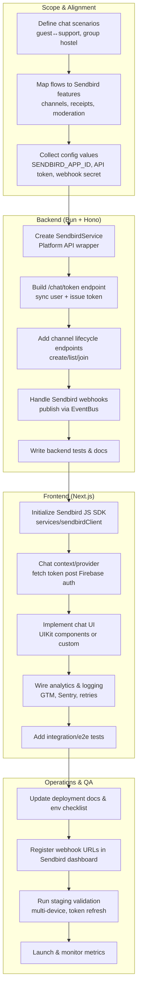
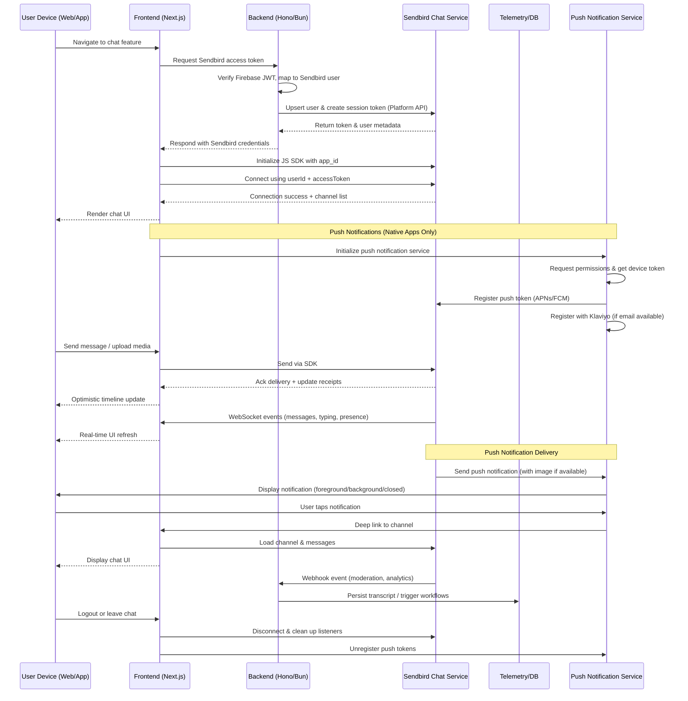
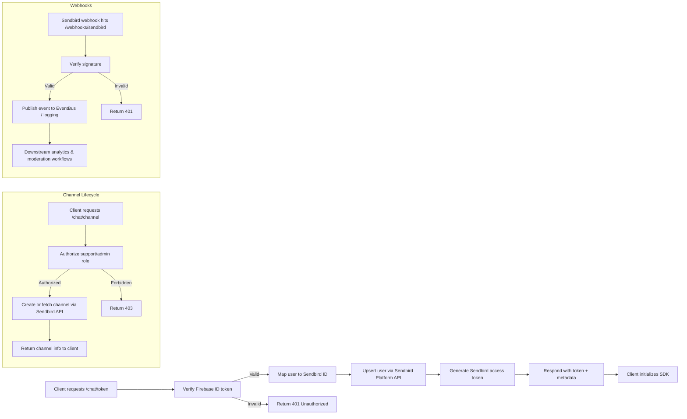

# Sendbird Integration Blueprint

This document outlines how we will integrate Sendbird Chat into the Mad Monkey platform. It covers scope, architecture, backend and frontend workstreams, operational rollout, and includes diagrams to visualise the flows. Feature references come from the official Sendbird Chat documentation ([Sendbird Chat overview](https://sendbird.com/docs/chat)).

---

## 1. Objectives & Scope

- Deliver real-time chat between guests, support, and property staff using Sendbird's group and 1:1 channels, read receipts, typing indicators, moderation, and push notifications.
- Keep security central by issuing Sendbird access tokens from our backend after Firebase-authenticated users are verified.
- Surface chat inside the existing Next.js frontend with minimal UX friction, reusing Redux state and the Capacitor mobile shell.
- **Push notifications are fully implemented** with image support for iOS (APNs) and Android (FCM), including deep linking to chat channels.

---

## 2. High-Level Architecture

> Diagram source: `docs/charts/SENDBIRD_HIGH_LEVEL_FLOW.mmd`

---

## 3. Detailed Flows

### 3.1 End-to-End Sequence

> Diagram source: `docs/charts/SENDBIRD_E2E_SEQUENCE.mmd`

---

## 4. Backend Integration (`backend/`)

1. **Service Layer (`services/SendbirdService.ts`)**

   - Wrap Sendbird Platform API endpoints for user upsert, channel creation, token issuance, and moderation actions.
   - Reuse existing HTTP utilities and error handling; respect Bun’s `fetch` capabilities and leverage retry helpers.
   - Support retries/backoff for transient failures.

2. **API Endpoints (`routes/chat.ts`)**

   - `POST /chat/token`: Authenticated (Firebase ID token) route that ensures the Sendbird user exists, then issues a scoped access token.
   - `POST /chat/channel`: Scoped to support/admin roles for creating or inviting users into channels.
   - `GET /chat/channels`: Returns a channel list for the requesting user, optionally filtering by booking or property.

3. **Webhook Handling**

   - Extend `routes/webhooks` to register a Sendbird webhook endpoint (e.g., `/webhooks/sendbird`).
   - Verify signatures and translate incoming events (message flagged, user banned, unread counts) into internal EventBus messages for logging, analytics, or moderation workflows.

4. **Configuration & Env**

   - Add environment variables: `SENDBIRD_APP_ID`, `SENDBIRD_API_TOKEN`, `SENDBIRD_WEBHOOK_SECRET`.
   - Update README/config docs to describe local and production setup, including secrets management.

5. **Testing**
   - Unit tests for service methods (Bun test runner with mocks).
   - Integration tests for the Hono routes to confirm auth gating and responses.
   - Webhook signature verification tests using fixture payloads.

---

## 5. Frontend Integration (`frontend/`)

1. **Client Initialization (`services/sendbirdClient.ts`)**

   - Lazy-load Sendbird's JavaScript SDK and initialise with the app ID.
   - Handle Capacitor-native detection for iOS and Android mobile builds.
   - Expose helpers for connecting, disconnecting, and subscribing to channels/events.
   - Push notification token registration methods for iOS (APNs) and Android (FCM).

2. **Context & State**

   - Create or extend `contexts/chatContext.tsx` to manage Sendbird state:
     - Fetch Sendbird token from the backend immediately after Firebase auth completes (works with existing `AuthBootstrapper`).
     - Store active channels, unread counters, typing indicators.
     - Subscribe/unsubscribe to SDK event handlers.
     - Auto-initialize push notifications on native platforms.

3. **UI Components**

   - Use Sendbird UIKit components for faster assembly (channel list, message list, input).
   - Custom MUI components integrated with Sendbird UIKit for brand consistency.
   - Entry points: header "Chat with us" CTA, booking detail pages, support drawers on mobile via Capacitor.
   - Custom chat components: `ChatChannelList`, `ChatWindow` with search, info sidebar, and profile redirects.

4. **Push Notifications** ✅ **IMPLEMENTED**

   - **Platform Support**: iOS (APNs) and Android (FCM) native apps
   - **Image Support**: Full support for images in push notifications
     - **Android**: Big picture images and large icons via custom `FileUriConverterPlugin`
     - **iOS**: Image attachments via native notification service
   - **Deep Linking**: Automatic navigation to chat channels from notification taps
   - **Architecture**: Provider-based system (Klaviyo, Sendbird) with centralized registration manager
   - **Critical Fixes Applied**:
     - Plugin registration timing fix (plugins must be registered BEFORE `super.onCreate()`)
     - Custom `FileUriConverterPlugin` for Android FileProvider integration
     - Java 21 requirement for Android builds (Capacitor Filesystem plugin dependency)
   - **Features**:
     - Foreground, background, and closed app state handling
     - Early listener setup for closed app notifications
     - Automatic token registration with Sendbird and Klaviyo
     - Image download, caching, and secure URI conversion (Android)
   - **Documentation**: See `docs/frontend/PUSH_NOTIFICATIONS.md` and `docs/frontend/PUSH_NOTIFICATIONS_ARCHITECTURE.md` for detailed implementation guides.

5. **Analytics & Logging**

   - Instrument chat events with `gtmPushEvent` (message sent/received, channel joined).
   - Integrate Sentry logging for failures (token issues, connection drops, push notification errors).
   - Provide offline/failed message retry UX with clear status indicators.

6. **Testing**
   - Component tests for the chat context and UI (React Testing Library).
   - E2E coverage (Playwright or Cypress) to validate multi-user messaging, refresh, and reconnect scenarios.
   - Push notification testing on iOS and Android devices with image payloads.

---

## 6. Operations & QA

1. **Documentation**

   - ✅ Project docs updated with Sendbird setup steps, environment variable requirements, and webhook registration instructions.
   - ✅ Troubleshooting sections added covering token expiration, moderation events, webhook retries, and push notification issues.
   - ✅ Frontend documentation: `docs/frontend/SENDBIRD_CHAT_INTEGRATION.md`
   - ✅ Push notification documentation: `docs/frontend/PUSH_NOTIFICATIONS.md` and `docs/frontend/PUSH_NOTIFICATIONS_ARCHITECTURE.md`
   - ✅ Android build requirements: `frontend/android/JAVA_21_REQUIREMENT.md`

2. **Webhooks & Security**

   - Register staging and production webhook URLs in the Sendbird dashboard.
   - Configure role-based channel permissions and moderation settings (automatic filters, manual reporting) per business needs.

3. **Staging Verification**

   - Test on multiple accounts/devices: connection lifecycle, message delivery, read receipts, typing indicators, token refresh after expiry.
   - Validate backend webhook processing and analytics triggers end to end.
   - **Push Notification Testing**:
     - Test push notifications on iOS and Android devices
     - Verify image display in notifications (big picture on Android, attachments on iOS)
     - Test deep linking from notifications to chat channels
     - Verify foreground, background, and closed app state handling
     - Test token registration with Sendbird and Klaviyo

4. **Android Build Requirements**

   - ⚠️ **Java 21 Required**: The Capacitor Filesystem plugin requires Java 21 for Android builds
   - Install Java 21 and set `JAVA_HOME` before building
   - See `frontend/android/JAVA_21_REQUIREMENT.md` for detailed setup instructions
   - **Critical**: Plugins must be registered in `MainActivity.java` BEFORE `super.onCreate()`

5. **Launch Checklist**
   - Propagate secrets via CI/CD.
   - Ensure monitoring dashboards capture chat metrics (active channels, message volume, error rates).
   - Prepare rollback plan (feature flags to disable chat endpoints/UI if required).
   - Verify push notification certificates/keys are configured in Sendbird dashboard (APNs for iOS, FCM for Android).

---

## 7. Push Notifications Implementation Details

### Status: ✅ **PRODUCTION READY**

Push notifications are fully implemented with comprehensive image support for both iOS and Android platforms.

### Key Features

- **Platform Support**: iOS (APNs) and Android (FCM)
- **Image Support**:
  - Android: Big picture images and large icons via custom `FileUriConverterPlugin`
  - iOS: Image attachments via native notification service
- **Deep Linking**: Automatic navigation to chat channels from notification taps
- **App State Handling**: Full support for foreground, background, and closed app states
- **Provider Integration**: Automatic token registration with Sendbird and Klaviyo

### Debug banner on `/my-chats`

- The chat page renders `ChatNotificationStatusBanner` (native only) to surface push diagnostics.
- Fields shown: truncated device token, overall provider registration flag, Sendbird registration flag (via `getSendbirdRegistrationStatus()`), and permission status.
- Useful when a device token already exists but needs confirmation that Sendbird push is registered for the current user.

### Critical Fixes Applied

1. **Plugin Registration Timing** (Android)

   - Fixed: Plugins must be registered in `MainActivity.java` BEFORE `super.onCreate()`
   - File: `frontend/android/app/src/main/java/com/madmonkey/madmonkey/MainActivity.java`
   - This was critical for Capacitor to discover custom plugins

2. **FileUriConverterPlugin** (Android)

   - Custom Capacitor plugin for secure image URI conversion
   - Handles Android FileProvider integration for notification images
   - Downloads, caches, and converts remote image URLs to secure `content://` URIs
   - File: `frontend/android/app/src/main/java/com/madmonkey/madmonkey/FileUriConverterPlugin.java`

3. **Java 21 Requirement** (Android)
   - Capacitor Filesystem plugin requires Java 21
   - Build will fail with older Java versions
   - See `frontend/android/JAVA_21_REQUIREMENT.md` for setup instructions

### Architecture

The push notification system uses a provider-based architecture:

- **PushNotificationService**: Core service handling platform detection, permissions, token management, and event handling
- **PushTokenRegistrationManager**: Orchestrates registration with multiple providers (Sendbird, Klaviyo)
- **Provider Pattern**: Extensible system for adding new push notification providers
- **Email Requirement**: Klaviyo registration requires customer email (API compliance)

### Image Support Implementation

**Android:**

- Images are downloaded and cached locally
- Converted to secure `content://` URIs via FileProvider
- Big picture style for expanded notifications
- Large icon for collapsed notifications
- Custom `FileUriConverterPlugin` handles URI conversion

**iOS:**

- Images loaded directly from URLs (no caching required)
- Attachments array for notification images
- Native iOS notification service handles display

### Related Documentation

- **Frontend Implementation**: `docs/frontend/PUSH_NOTIFICATIONS.md`
- **Architecture Details**: `docs/frontend/PUSH_NOTIFICATIONS_ARCHITECTURE.md`
- **Android Fix Summary**: `frontend/ANDROID_PUSH_NOTIFICATION_FIX_SUMMARY.md`
- **Java 21 Setup**: `frontend/android/JAVA_21_REQUIREMENT.md`
- **Chat Integration**: `docs/frontend/SENDBIRD_CHAT_INTEGRATION.md`
- **Troubleshooting (BadDeviceToken)**: See `frontend/docs/PUSH_NOTIFICATION_TROUBLESHOOTING.md` — real-world fix was matching Sendbird dashboard APNs environment to the app build (dev vs prod); token was valid hex.

### Troubleshooting

Common issues and solutions:

1. **Images not displaying (Android)**:

   - Verify `FileUriConverterPlugin` is registered BEFORE `super.onCreate()`
   - Check FileProvider configuration in `AndroidManifest.xml`
   - Verify `file_paths.xml` includes cache path
   - Check Logcat for URI conversion errors

2. **Plugin not implemented**:

   - Verify plugin registration order in `MainActivity.java`
   - Run `npx cap sync android` after changes
   - Clean and rebuild the app

3. **Build failures**:

   - Ensure Java 21 is installed and `JAVA_HOME` is set
   - Verify Gradle configuration

4. **Token not registering**:
   - Check Sendbird connection state (must be OPEN)
   - Verify permissions are granted
   - Check console logs for registration errors

5. **"Go to Settings" button doesn't work on iOS** (Fixed December 2024):
   - **Issue**: Button clicked but nothing happens on iOS
   - **Root Cause**: `PushNotifications.openSettings()` not implemented in Capacitor 7.0.1 for iOS
   - **Solution**: Fallback to `capacitor-native-settings` plugin with `IOSSettings.App`
   - **Status**: ✅ Fixed - Uses fallback chain: `PushNotifications.openSettings()` → `NativeSettings.open()` → `App.openSettings()`
   - **Documentation**: See `frontend/docs/PUSH_NOTIFICATION_TROUBLESHOOTING.md` for details

---

## 8. References

- Sendbird Chat product and documentation: [https://sendbird.com/docs/chat](https://sendbird.com/docs/chat)
- Sendbird Push Notifications: [https://sendbird.com/docs/chat/sdk/v3/javascript/guides/push-notifications](https://sendbird.com/docs/chat/sdk/v3/javascript/guides/push-notifications)
- Capacitor Push Notifications: [https://capacitorjs.com/docs/apis/push-notifications](https://capacitorjs.com/docs/apis/push-notifications)
- Android FileProvider: [https://developer.android.com/reference/androidx/core/content/FileProvider](https://developer.android.com/reference/androidx/core/content/FileProvider)

---

### Appendix A — Backend Flowchart

> Diagram source: `docs/charts/SENDBIRD_BACKEND_FLOW.mmd`

