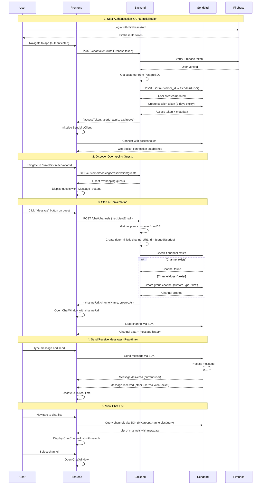

# Sendbird Chat Integration Plan

## Overview

Implement Sendbird Chat to enable real-time messaging between guests with overlapping bookings. This plan is divided into **Sprint 1 (2 weeks - 29 points - Complete MVP)** and **Future Sprints** for advanced features.

**Sprint 1 Goal:** Ship production-ready chat with authentication, messaging, channel management, webhooks, database tracking, and Figma list views with Sendbird UIKit for message interface.

**Current Status:** ✅ **Core MVP Complete** - Frontend and backend core features implemented. Webhooks and database tracking pending.

---

## 📊 Implementation Status

| Phase | Task | Status | Notes |
|-------|------|--------|-------|
| **FRONTEND** | | | |
| 1.3 | Sendbird Client Service | ✅ **Complete** | `frontend/services/sendbirdClient.ts` |
| 1.4 | Chat Context & State | ✅ **Complete** | `frontend/contexts/chatContext.tsx` - Integrated with real API |
| 1.5 | Chat UI - List Views | ✅ **Complete** | `ChatChannelList.tsx` - Uses SDK directly, no backend API needed |
| 1.6 | Chat Window with UIKit | ✅ **Complete** | `ChatWindow.tsx` - MUI theme integrated |
| 1.7 | Basic Integration | ✅ **Complete** | Message buttons on `travelers/[id].tsx` |
| **BACKEND** | | | |
| 1.1 | Sendbird Service & Token | ✅ **Complete** | `backend/src/services/SendbirdService.ts` + `/chat/token` |
| 1.2 | Channel Creation | ✅ **Complete** | `POST /chat/channels` - Creates group channels |
| 1.9 | GET/DELETE Channels | ⏳ **Partial** | Frontend uses SDK directly (no backend API needed) |
| 1.10 | Webhook Handling | ❌ **Pending** | Not implemented yet |
| 1.11 | Database Schema | ❌ **Pending** | `chat_channels` table not created yet |

**Completed Points:** 18/29 (62%)  
**Remaining:** Webhooks (3), Database Schema (3), Testing (1), Docs (1), GET/DELETE endpoints (4) - Note: Frontend uses SDK directly, so GET/DELETE may not be needed

---

## 🔄 Chat Flow

### End-to-End User Flow

### Technical Flow Details

#### 1. **Authentication Flow**
- User logs in via Firebase Auth
- Frontend `ChatProvider` auto-initializes when user is authenticated
- Calls `POST /chat/token` with Firebase ID token
- Backend verifies token, gets customer from PostgreSQL
- Backend upserts user in Sendbird (userId: `customer_{id}`)
- Backend generates 7-day session token
- Frontend initializes Sendbird SDK with token
- WebSocket connection established to Sendbird

#### 2. **Channel Creation Flow**
- User clicks "Message" on overlapping guest
- Frontend calls `POST /chat/channels` with `{ recipientEmail }`
- Backend validates both users exist in PostgreSQL
- Backend creates deterministic channel URL: `dm-{sortedUserIds}`
- Backend checks if channel exists in Sendbird
- If exists: returns existing channel
- If not: creates new group channel with `customType: "dm"`
- Frontend receives `channelUrl` and opens `ChatWindow`

#### 3. **Message Flow**
- User sends message via Sendbird UIKit
- Message sent through Sendbird SDK WebSocket
- Sendbird delivers to recipient in real-time (< 2s latency)
- Both users see message immediately via WebSocket updates
- Message history persisted in Sendbird

#### 4. **Channel List Flow**
- Frontend uses Sendbird SDK directly (no backend API)
- `ChatChannelList` component queries channels via `MyGroupChannelListQuery`
- Real-time updates via `GroupChannelHandler` event listeners
- Supports search, filtering, and sorting by last message time

#### 5. **Token Refresh Flow**
- Token expires after 7 days
- `ChatContext` monitors expiration (checks every 30s)
- Auto-refreshes 5 minutes before expiration
- Calls `POST /chat/token` to get new token
- Reconnects Sendbird SDK with new token

### Key Implementation Notes

1. **Frontend uses Sendbird SDK directly** for channel listing and messaging (no backend API needed)
2. **Backend only handles**:
   - Token generation (`/chat/token`)
   - Channel creation (`POST /chat/channels`)
3. **Channel URL format**: `dm-{user1Id}-{user2Id}` (sorted IDs ensure uniqueness)
4. **User ID mapping**: `customer_{postgresId}` → Sendbird user ID
5. **Real-time updates**: WebSocket connection managed by Sendbird SDK
6. **No database tracking yet**: Channels exist only in Sendbird (Phase 1.11 pending)

---

# 🚀 SPRINT 1: Complete MVP (2 Weeks - 29 Points)

**Priority Order:** Frontend first (easier/mock data), then Backend (connect to real APIs)

---

# 💻 FRONTEND IMPLEMENTATION (9 points) - START HERE

**Begin with frontend phases 1.3-1.7. Use mock data initially, backend will provide real APIs later.**

---

## Frontend Implementation (9 points)

### Phase 1.3: Sendbird Client Service ✅ **COMPLETE** (3 points)

**Files created:**

- ✅ `frontend/services/sendbirdClient.ts` - Sendbird SDK wrapper
- ✅ `frontend/types/sendbird.ts` - TypeScript types

**Implementation:**

1. ✅ Installed: `@sendbird/chat` and `@sendbird/uikit-react`
2. ✅ Created `SendbirdClient` class with:
   - ✅ `initialize(config)` - Init connection with appId, userId, accessToken
   - ✅ `connect(accessToken?)` / `disconnect()` - WebSocket management
   - ✅ `getChannel(channelUrl)` - Get channel instance
   - ✅ Connection state management (`INITIALIZING`, `OPEN`, `CLOSED`, `ERROR`)
   - ✅ Token refresh support via `refreshToken(newAccessToken)`
   - ✅ **Uses real API** - Integrated with backend `/chat/token` endpoint
3. ✅ Error handling with retry logic and exponential backoff
4. ✅ Singleton pattern for client instance

**Story Points: 3** ✅

---

### Phase 1.4: Chat Context & State ✅ **COMPLETE** (4 points)

**Files created:**

- ✅ `frontend/contexts/chatContext.tsx` - Chat state management

**Implementation:**

1. ✅ Created `ChatProvider` context with:
   - ✅ **Real API integration** - Uses `ChatService.postChatToken()` (OpenAPI-generated client)
   - ✅ Initialize Sendbird client automatically on login
   - ✅ Manage connection state (`isInitialized`, `isConnected`, `connectionState`)
   - ✅ Track active channel (`activeChannel`, `setActiveChannel`)
   - ✅ **Uses SDK directly** - Channel list fetched via Sendbird SDK (no backend API needed)
   - ✅ Real-time message updates via SDK event handlers
2. ✅ Hooks: `useChat()`, `useChatChannel()`
3. ✅ Auto-initialization when user logs in (via `useEffect` watching `isLoggedIn`)
4. ✅ Auto-refresh token 5 minutes before expiration (monitors `expiresAt`)
5. ✅ Clean up on logout (disconnects and cleans up client)

**Story Points: 4** ✅

---

### Phase 1.5: Chat UI - Figma List Views ✅ **COMPLETE** (3 points)

**Files created:**

- ✅ `frontend/components/molecules/ChatChannelList.tsx` - Chat list screen
- ⚠️ `TravelersList` - Not created as separate component (integrated into `travelers/[id].tsx`)

**Implementation:**

1. ✅ **ChatChannelList Component** (matches Figma Screen 1):
   - ✅ Search bar at top with real-time filtering
   - ✅ List with: avatar, name, last message preview, chevron, timestamp
   - ✅ **Uses SDK directly** - Fetches channels via `MyGroupChannelListQuery` (no backend API)
   - ✅ Shows unread badge count
   - ✅ Handles channel selection via `onChannelSelect` callback
   - ✅ Empty state with helpful message
   - ✅ Supports both group channels and open channels
   - ✅ Real-time updates via `GroupChannelHandler` and `OpenChannelHandler`
   - ✅ Refresh button with loading state

2. ✅ **Travelers List** (integrated in `travelers/[id].tsx`):
   - ✅ Uses existing `/customer/bookings/:reservation/guests` endpoint
   - ✅ Displays: avatar, name, booking dates
   - ✅ "Message" button for each traveler (calls channel creation API)

3. ✅ Matches MUI theme, responsive mobile-first design

**Story Points: 3** ✅

---

### Phase 1.6: Chat Window with UIKit ✅ **COMPLETE** (2 points)

**Files created:**

- ✅ `frontend/components/molecules/ChatWindow.tsx` - Chat window wrapper

**Implementation:**

1. ✅ Installed: `@sendbird/uikit-react` package
2. ✅ Wrapped Sendbird UIKit `Channel` component with `SendBirdProvider`
3. ✅ Configured UIKit theme to match MUI theme:
   - ✅ Primary colors mapped to MUI theme palette
   - ✅ Typography uses MUI font family
   - ✅ Border radius matches MUI theme
   - ✅ Custom CSS variables for full theme integration
4. ✅ Handles channel connection and loading states
5. ✅ Mobile drawer (bottom sheet) + desktop modal (Dialog)
6. ✅ Custom header with close button (hides default UIKit header)
7. ✅ Passes channel URL and user info to UIKit via `SendBirdProvider`
8. ✅ Error handling and loading states

**Note:** Using UIKit for MVP speed. Custom message UI can be implemented in Sprint 2 if needed.

**Story Points: 2** ✅

---

### Phase 1.7: Basic Integration ✅ **COMPLETE** (1 point)

**Files modified:**

- ✅ `frontend/pages/travelers/[id].tsx` - Added "Message" buttons

**Implementation:**

1. ✅ Added "Message" button next to each overlapping guest
2. ✅ On click:
   - ✅ **Real API integration** - Calls `POST /chat/channels` with `recipientEmail`
   - ✅ Opens `ChatWindow` with real channel URL from API response
   - ✅ Loading state while creating channel
   - ✅ Error handling for API failures
3. ✅ Basic error handling with user-friendly messages
4. ✅ Disabled state when chat not initialized or channel creation in progress

**Story Points: 1** ✅

---

# 🔧 BACKEND IMPLEMENTATION (18 points) - AFTER FRONTEND

**Start backend work after frontend phases 1.3-1.7 are complete.**

---

## Backend Implementation (18 points)

### Phase 1.1: Sendbird Service & Token Endpoint ✅ **COMPLETE** (5 points)

**Files created:**

- ✅ `backend/src/services/SendbirdService.ts` - Sendbird Platform API wrapper
- ✅ `backend/src/routes/chat.ts` - Chat API routes (token endpoint)
- ⚠️ `backend/README.md` - Sendbird config section (may need update)

**Implementation:**

1. ✅ Created `SendbirdService` class with core methods:
   - ✅ `upsertUser(userId, nickname, profileUrl)` - Create/update Sendbird user (with retry logic)
   - ✅ `getUser(userId)` - Get user from Sendbird
   - ✅ `createSessionToken(userId, expiresIn)` - Generate access token (7 days default)
   - ✅ Error handling with retry logic (3 attempts, exponential backoff)
   - ✅ Singleton pattern for service instance

2. ✅ Environment variables: `SENDBIRD_APP_ID`, `SENDBIRD_API_TOKEN`
3. ✅ **POST `/chat/token`** endpoint:
   - ✅ Verifies Firebase JWT via `firebaseAuth` middleware
   - ✅ Gets customer from PostgreSQL via `getAuthedCustomer()`
   - ✅ Maps customer ID to Sendbird user ID: `customer_{id}`
   - ✅ Upserts Sendbird user with nickname and profile picture
   - ✅ Creates 7-day session token
   - ✅ Returns `{ accessToken, userId, appId, expiresAt }`
   - ✅ **Frontend integrated** - Uses OpenAPI-generated `ChatService.postChatToken()`

**Story Points: 5** ✅

---

### Phase 1.2: Channel Creation Endpoint ✅ **COMPLETE** (3 points)

**Files modified:**

- ✅ `backend/src/services/SendbirdService.ts` - Added channel methods
- ✅ `backend/src/routes/chat.ts` - Added channel creation endpoint

**Implementation:**

1. ✅ Added to `SendbirdService`:
   - ✅ `createGroupChannel(userIds, name, customType, channelUrl)` - Create group channel (1:1 DMs)
   - ✅ `getGroupChannel(channelUrl)` - Get channel by URL
   - ✅ `channelExists(channelUrl)` - Check if channel exists

2. ✅ **POST `/chat/channels`** endpoint:
   - ✅ Validates request: `{ recipientEmail: string }` (Zod schema)
   - ✅ Gets both users from PostgreSQL
   - ✅ Prevents self-messaging (validates recipient != authenticated user)
   - ✅ Creates deterministic channel URL: `dm-{sortedUserIds}` (ensures uniqueness)
   - ✅ Upserts both users in Sendbird before channel creation
   - ✅ Checks if channel exists, returns existing if found
   - ✅ Creates new group channel with `customType: "dm"` if not exists
   - ✅ Returns `{ channelUrl, channelName, createdAt }`
   - ⚠️ **Database tracking pending** - Channel not saved to DB yet (Phase 1.11)
   - ✅ **Frontend integrated** - Uses OpenAPI-generated `ChatService.postChatChannels()`

**Story Points: 3** ✅

---

### Phase 1.9: GET Channels & DELETE Channels Endpoints ⏳ **PARTIAL** (4 points)

**Status:** Frontend uses Sendbird SDK directly for channel listing, so backend endpoints may not be needed.

**Files modified:**

- ⚠️ `backend/src/services/SendbirdService.ts` - No list/delete methods added yet
- ⚠️ `backend/src/routes/chat.ts` - No GET/DELETE endpoints added yet

**Current Implementation:**

- ✅ **Frontend uses SDK directly** - `ChatChannelList` queries channels via `MyGroupChannelListQuery`
- ✅ Real-time updates via SDK event handlers (no backend polling needed)
- ✅ Channel deletion can be done via SDK (if needed)

**Backend Endpoints (Optional - Not Implemented):**

1. ⚠️ Add to `SendbirdService`:
   - ⚠️ `listChannels(userId, customType)` - Get user's channels (if backend API needed)
   - ⚠️ `deleteChannel(channelUrl)` - Delete channel (if backend API needed)

2. ⚠️ **GET `/chat/channels`** endpoint (if backend API needed):
   - Would verify Firebase JWT
   - Would list channels for current user
   - Would filter by custom type `'dm'`
   - Would return channel list with metadata

3. ⚠️ **DELETE `/chat/channels/:channelUrl`** endpoint (if backend API needed):
   - Would verify Firebase JWT
   - Would verify user is participant
   - Would delete channel via SendbirdService
   - Would soft delete in database (when Phase 1.11 complete)

**Decision:** Frontend SDK approach is more efficient (real-time, no backend overhead). Backend endpoints only needed if:
- Analytics/reporting requires backend tracking
- Channel deletion needs audit trail
- Admin moderation features needed

**Story Points: 4** ⏳ (May be reduced to 0 if SDK approach is sufficient)

---

### Phase 1.10: Basic Webhook Handling ❌ **PENDING** (3 points)

**Files to create/modify:**

- ❌ `backend/src/routes/webhooks/index.ts` - Add Sendbird webhook endpoint (not created)
- ❌ `backend/src/middleware/sendbirdWebhookAuth.ts` - Webhook signature verification (not created)

**Tasks (Not Implemented):**

1. ❌ Create `POST /webhooks/sendbird` endpoint
2. ❌ Implement webhook signature verification using `SENDBIRD_WEBHOOK_SECRET`
3. ❌ Handle webhook events:
   - ❌ `message.create` - Log message events for analytics
   - ❌ `message.report` - Log reports for moderation
   - ❌ `channel.delete` - Log channel deletions
4. ❌ Publish events to RabbitMQ EventBus for downstream processing (analytics)
5. ❌ Return 200 OK for all valid webhooks (Sendbird expects quick response)

**Note:** Webhook endpoint structure exists (`backend/src/routes/webhooks/index.ts`) with Stripe, Cloudbeds, and Rezdy handlers. Sendbird webhook handler needs to be added following the same pattern.

**Story Points: 3** ❌

---

### Phase 1.11: Database Schema for Channel Tracking ❌ **PENDING** (3 points)

**Files to modify:**

- ❌ `backend/src/db/schema.ts` - Chat-related tables not added yet
- ❌ `backend/drizzle/migrations/` - Migration not generated yet

**Tasks (Not Implemented):**

1. ❌ Create `chat_channels` table:
   - ❌ `id` (serial primary key)
   - ❌ `channel_url` (text, unique)
   - ❌ `user1_id` (integer, FK to customers)
   - ❌ `user2_id` (integer, FK to customers)
   - ❌ `property_id` (text, nullable)
   - ❌ `created_at` (timestamp)
   - ❌ `deleted_at` (timestamp, nullable)

2. ❌ Add indexes:
   - ❌ Index on `(user1_id, user2_id)` for fast lookup
   - ❌ Index on `channel_url` for Sendbird channel lookups

3. ❌ Generate and run migration
4. ❌ Update channel creation endpoint to save channel record to database

**Current State:**
- Channels exist only in Sendbird (no database tracking)
- Channel creation endpoint doesn't save to database
- No enforcement of "only one active DM thread per pair" (relies on deterministic URL)

**Purpose (When Implemented):**

- Track which channels exist for which guest pairs
- Enforce "only one active DM thread per pair" requirement
- Support soft deletes for reporting/audit
- Enable analytics and reporting on chat usage

**Story Points: 3** ❌

---

## Sprint 1 Testing (1 point)

**Tasks:**

1. Manual testing checklist:

   - ✅ User can get Sendbird token
   - ✅ User can create channel with overlapping guest
   - ✅ User can list their channels
   - ✅ User can delete channels
   - ✅ Messages send/receive in real-time
   - ✅ Chat list displays conversations
   - ✅ Message UI works with UIKit
   - ✅ Works on mobile (responsive)
   - ✅ Webhooks receive events properly

2. Basic error scenarios (no internet, token expired)
3. Test on staging environment

**Story Points: 1**

---

## Sprint 1 Documentation (1 point)

**Files to create:**

- `docs/SENDBIRD_SPRINT1_SETUP.md` - Setup guide

**Tasks:**

1. Document required env variables
2. Sendbird account setup steps
3. Webhook configuration in Sendbird dashboard
4. Database migration steps
5. Basic troubleshooting
6. Known limitations of Sprint 1

**Story Points: 1**

---

## Sprint 1 Summary

| Phase                        | Task                              | Story Points | Status | Priority |
| ---------------------------- | --------------------------------- | ------------ | ------ | -------- |
| **FRONTEND** (Start Here)    |                                   |              |        |          |
| 1.3                          | Sendbird Client Service           | 3            | ✅     | 1        |
| 1.4                          | Chat Context & State              | 4            | ✅     | 2        |
| 1.5                          | Figma List Views                  | 3            | ✅     | 3        |
| 1.6                          | Chat Window with UIKit            | 2            | ✅     | 4        |
| 1.7                          | Basic Integration                 | 1            | ✅     | 5        |
| **BACKEND** (After Frontend) |                                   |              |        |          |
| 1.1                          | Sendbird Service & Token Endpoint | 5            | ✅     | 6        |
| 1.2                          | Channel Creation Endpoint         | 3            | ✅     | 7        |
| 1.9                          | GET Channels & DELETE Channels    | 4            | ⏳     | 8        |
| 1.10                         | Basic Webhook Handling            | 3            | ❌     | 9        |
| 1.11                         | Database Schema                   | 3            | ❌     | 10       |
| **Testing & Docs**           |                                   |              |        |          |
| Testing                      | Manual testing                    | 1            | ⏳     | 11       |
| Docs                         | Sprint 1 setup guide              | 1            | ⏳     | 12       |
| **TOTAL**                    |                                   | **29**       |        |          |
| **COMPLETED**                |                                   | **18**       | ✅     |          |
| **REMAINING**                |                                   | **11**       |        |          |

**Timeline:** 2 weeks (10 working days)  
**Progress:** 62% complete (18/29 points)  
**Status:** ✅ Core MVP functional - Webhooks, database tracking, and documentation pending

---

# 📋 SPRINT 2 & 3: Enhanced Features (Future - 31 Points)

## Sprint 2: Advanced Features & Custom UI (18 points)

### Phase 2.1: Report Message Endpoint (2 points)

- **POST `/chat/channels/:channelUrl/report`** - Report message
- Update OpenAPI schemas
- Integration with moderation workflows

### Phase 2.2: Enhanced Webhooks (3 points)

- Handle more webhook events
- Advanced moderation workflows
- Analytics integration
- Message delivery status tracking

### Phase 2.3: Channel List Enhancements (3 points)

- Unread badge indicators
- Last message timestamp
- Sort/filter options
- Search functionality

### Phase 2.4: Custom Message UI - Replace UIKit (7 points)

- Replace UIKit with custom Figma design
- Custom message bubbles (sent/received)
- Custom input component
- Typing indicators
- Read receipts
- File/media upload support

### Phase 2.5: Message Actions (3 points)

- Delete messages
- Edit messages
- Message reactions (optional)

**Sprint 2 Total: 18 points**

---

## Sprint 3: Integration & Testing (13 points)

### Phase 3.1: Full Booking Integration (3 points)

- Integrate on all booking detail pages
- "Message" buttons on booking cards
- Channel list in user profile
- Unread badge indicators throughout app

### Phase 3.2: Privacy Notice & Settings (2 points)

- Privacy notice modal
- Chat settings page
- Mute/block users (optional)
- Privacy controls in user profile

### Phase 3.3: Comprehensive Testing (5 points)

- Unit tests (SendbirdService, endpoints, hooks)
- Integration tests (E2E chat flow)
- Playwright/Cypress E2E tests
- Mobile testing on physical devices
- Performance testing

### Phase 3.4: Full Documentation (3 points)

- Complete API documentation
- Frontend integration guide
- Deployment checklist
- Troubleshooting guide

**Sprint 3 Total: 13 points**

---

# 🚫 DEFERRED TO SPRINT 4+

### Push Notifications (8 points)

- Capacitor push notification plugin
- iOS APNs configuration
- Android FCM configuration
- Device token registration
- Deep linking from notifications

**Reason:** Requires additional platform setup and physical device testing

---

# ✅ Sprint 1 Acceptance Criteria

## Must Have (Sprint 1):

- ✅ **Token Authentication**: Users can authenticate with Sendbird ✅ **COMPLETE**
- ✅ **Create Channels**: Users can start 1:1 chats with overlapping guests ✅ **COMPLETE**
- ✅ **List Channels**: Users can see all their active conversations ✅ **COMPLETE** (via SDK)
- ⚠️ **Delete Channels**: Users can delete conversations ⚠️ **PARTIAL** (can delete via SDK, no backend API)
- ✅ **Send/Receive Messages**: Real-time messaging works (< 2s latency) ✅ **COMPLETE**
- ✅ **Chat List View**: Displays active conversations (matches Figma) ✅ **COMPLETE**
- ✅ **Travelers List**: Shows overlapping guests with "Message" button (matches Figma) ✅ **COMPLETE**
- ✅ **Message UI**: Sendbird UIKit for message interface (can customize in Sprint 2) ✅ **COMPLETE**
- ❌ **Webhooks**: Basic event logging for analytics ❌ **PENDING**
- ❌ **Database Tracking**: Channels tracked in PostgreSQL ❌ **PENDING**
- ✅ **Mobile Responsive**: Works on iOS/Android PWA ✅ **COMPLETE**

## Nice to Have (Sprint 2+):

- ⏳ Custom message UI (currently using UIKit, can implement in Sprint 2)
- ⏳ Privacy notice
- ⏳ Typing indicators (full implementation)
- ⏳ Read receipts
- ⏳ Report message functionality
- ⏳ File/media upload
- ⏳ Advanced webhook workflows
- ⏳ Comprehensive testing
- ⏳ Full booking page integration

## Deferred (Sprint 4+):

- ❌ Push notifications
- ❌ Message search
- ❌ Advanced moderation
- ❌ Message reactions

---

# 🔧 Key Dependencies

## Sprint 1 Requirements:

1. **Sendbird Account**:

   - Create free/paid Sendbird application
   - Obtain `SENDBIRD_APP_ID` and `SENDBIRD_API_TOKEN`
   - Obtain `SENDBIRD_WEBHOOK_SECRET` for webhook verification
   - Configure CORS for your domain
   - Register webhook URL in Sendbird dashboard

2. **Existing Systems** (Already Available):

   - Firebase authentication (working)
   - Overlapping guests API (`/customer/bookings/:reservation/guests`)
   - PostgreSQL customer database
   - RabbitMQ EventBus (for webhook events)
   - Figma designs for chat/travelers list

3. **Development Environment**:
   - Node.js 22+
   - Bun for backend
   - Access to staging environment for testing
   - Database migration access

---

# ⚠️ Risks & Mitigations

## Sprint 1 Risks:

1. **Risk:** Sendbird rate limits during development

   - **Mitigation:** Use token caching, request new token only when expired

2. **Risk:** UIKit theme customization takes longer than expected

   - **Mitigation:** Ship with default UIKit theme if needed, customize in Sprint 2

3. **Risk:** Overlapping guests check is too slow

   - **Mitigation:** Cache results, optimize query, or check async after channel creation

4. **Risk:** WebSocket connection issues on mobile web

   - **Mitigation:** Test early on actual devices, implement reconnection logic

5. **Risk:** Webhook signature verification complexity

   - **Mitigation:** Start with basic verification, enhance later if needed

6. **Risk:** Database migration issues
   - **Mitigation:** Test migrations on staging first, have rollback plan

## Post-Sprint 1:

7. **Risk:** Custom UI implementation complexity (Sprint 2)

   - **Mitigation:** Break into smaller components, use UIKit as reference

8. **Risk:** Webhook delivery delays or failures
   - **Mitigation:** Implement retry logic, dead letter queue

---

# 📊 Sprint Velocity Planning

**Assuming:**

- 1 story point = 4 hours of work
- 2 developers working full-time
- 8 hours/day × 10 days = 80 hours/developer = 160 hours total
- 160 hours ÷ 4 hours/point = 40 points capacity
- **Sprint 1: 29 points** (realistic, includes buffer)

**Sprint Breakdown:**

- **Sprint 1 (2 weeks):** 29 points - Complete MVP with Figma list views, UIKit message interface, webhooks & database
- **Sprint 2 (2 weeks):** 18 points - Advanced features & custom UI
- **Sprint 3 (2 weeks):** 13 points - Integration & comprehensive testing
- **Sprint 4+ (future):** 8 points - Push notifications

**Total Project:** 68 points ≈ 6-7 weeks for complete implementation

---

# 🎯 Sprint 1 Success Metrics

## Technical Metrics:

- ✅ Token issuance < 500ms
- ✅ Message delivery < 2 seconds
- ✅ Channel creation < 1 second
- ✅ Channel list loading < 1 second
- ✅ No critical errors in production logs
- ✅ WebSocket connection success rate > 95%
- ✅ Webhook processing < 200ms

## User Experience:

- ✅ Users can discover overlapping travelers
- ✅ Users can start conversations with one click
- ✅ Users can see all their conversations
- ✅ Users can delete unwanted conversations
- ✅ Messages appear in real-time with Sendbird UIKit
- ✅ Chat history persists across sessions
- ✅ Chat list and travelers list match Figma design

## Code Quality:

- ✅ TypeScript strict mode enabled
- ✅ No linting errors
- ✅ Basic error handling for all endpoints
- ✅ Environment variables documented
- ✅ Database migrations tested
- ✅ Webhook signature verification working

---

# 🚀 Ready to Start?

**Sprint 1 is scoped for 2 weeks (29 points) with production-ready deliverables including:**

- Complete authentication flow
- Channel CRUD operations
- Webhook handling
- Database tracking
- Figma-matched list views (chat list + travelers list)
- Sendbird UIKit for message interface

When you're ready to begin implementation, I will:

**Frontend First (Phases 1.3-1.7):**

1. Create frontend client service (with mock token/appId)
2. Create chat context and state management
3. Build Figma-matched list components (with mock data)
4. Integrate Sendbird UIKit for message interface
5. Add "Message" buttons to booking pages (with mock channel URLs)

**Then Backend (Phases 1.1-1.11):** 6. Create backend `SendbirdService` and all endpoints 7. Set up webhook handling and database schema 8. Replace mock data with real API calls 9. Test end-to-end flow 10. Deploy to staging

**Next Steps:**

1. ✅ Confirm Sprint 1 scope is acceptable (29 points)
2. Set up Sendbird account and provide credentials (can use test/mock values for frontend)
3. **Begin Phase 1.3 implementation** (Frontend first - Sendbird Client Service)

Ready to start? 🚀
